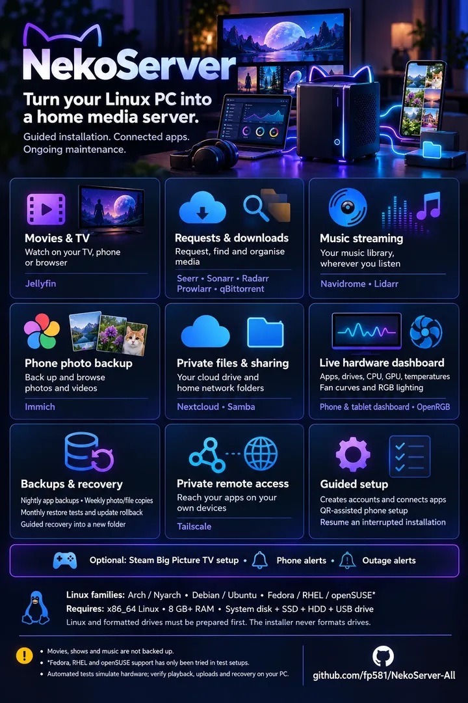
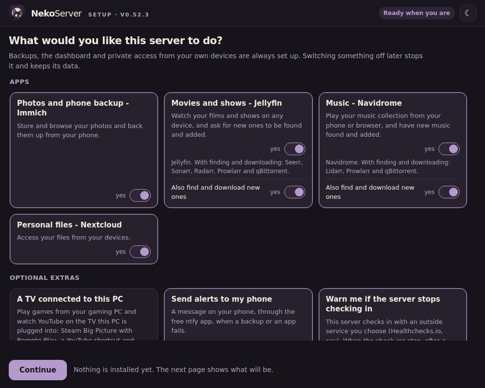
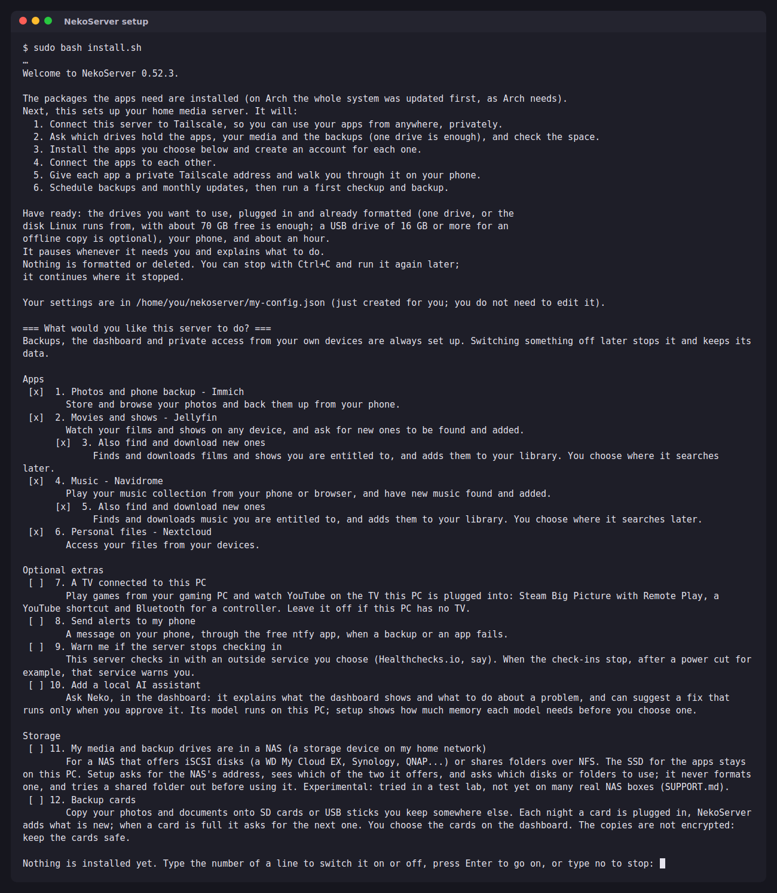
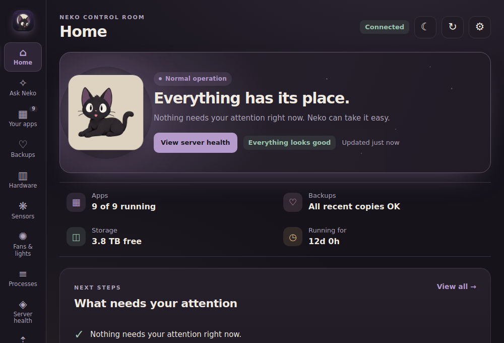
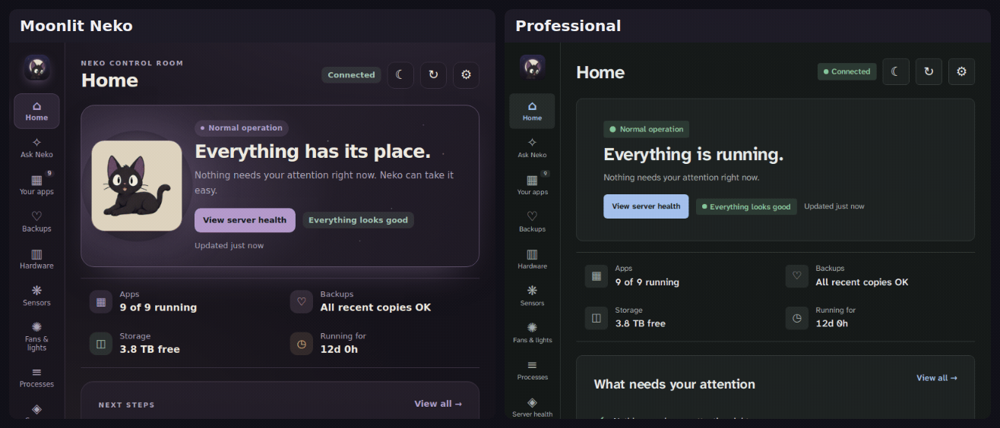

# NekoServer

<p align="center">
  
</p>

**Turn a Linux PC into a home server** for your photos, films, music and files. One guided setup installs the apps you choose, makes an account in each one, connects them to each other and sets up the backups. You choose once, approve once, and setup does the rest. It never formats a drive and never deletes your files.

## What you can switch on

Setup's first page asks one thing: *What would you like this server to do?* Each line is a switch.

| | |
| --- | --- |
| 📷 **Photos and phone backup** | Immich: store and browse your photos, and back them up from your phone |
| 🎬 **Movies and shows** | Jellyfin: watch your films and shows on any device. With **Also find and download new ones** switched on (it is, unless you switch it off) it comes with Seerr, Sonarr, Radarr, Prowlarr and qBittorrent |
| 🎵 **Music** | Navidrome: play your music from your phone or browser. With **Also find and download new ones** switched on (it is, unless you switch it off) it comes with Lidarr, Prowlarr and qBittorrent |
| ☁️ **Personal files** | Nextcloud: your files on your own devices |
| 📺 **A TV connected to this PC** | Steam Big Picture and a YouTube shortcut. It needs **Movies and shows**: its TV mode opens Jellyfin (off unless you switch it on) |
| 🔔 **Alerts on your phone** | A message, through the free ntfy app, when a backup or an app fails (off unless you switch it on) |
| 💓 **A warning when the server stops** | An outside service you choose notices when the server goes quiet (off unless you switch it on) |
| 🐈 **Ask Neko** | A local AI assistant in the dashboard (off unless you switch it on) |
| 💾 **Backup cards** | A copy of your photos and Nextcloud files on SD cards or USB sticks you keep somewhere else, filled a little more each night one is plugged in; each card can be read on any Linux computer with nothing installed (off unless you switch it on) |

Always set up, whatever you choose: the **dashboard** (with a PIN, in two themes: Moonlit Neko with its cat, or a quiet Professional one, each light or dark), **backups** with a monthly checkup, **private access from your own devices** through Tailscale, and **shared folders** on your home network.

Any combination works, including none of the apps. Switching something off later stops it and keeps its data.

## What you need

- A 64-bit PC with **Arch Linux, Nyarch, Debian 12+, Ubuntu 24.04+, Fedora 42+, RHEL 10+ or openSUSE Leap 16+ / Tumbleweed** (also Rocky Linux, AlmaLinux, CentOS Stream 10+, and systems built on Arch, Debian or Ubuntu, such as Linux Mint). Fedora, RHEL and openSUSE support is new and was tried only in a test setup without SELinux. NekoServer has not been proven on many real installs yet, so try it on a spare PC or a virtual machine first.
- **Somewhere to keep things. One drive is enough.** Setup shows every drive connected to the PC and you choose, line by line, where the apps, your media and the backups go:
  - One drive can hold everything: a drive of its own, or the disk Linux runs from (about 70 GB free). Setup says what that means before you choose it: if that one drive fails, your files and their backups are lost together.
  - With more drives, put the apps on the fastest and the media and backups on the biggest. Immich's photos, the films and shows, the music and Nextcloud's files can each be kept on a drive of their own. The apps themselves are installed together, on one drive.
  - Drives must already be formatted (ext4 is the safe choice). Setup never formats one.
- **A network storage box (NAS) is optional.** Your media and the backups can be on a NAS, as a disk of its own (iSCSI) or as a folder it shares (NFS). The apps always stay on a drive in or on this PC. NAS storage is experimental; folders shared the Windows way (SMB) are not supported yet. [SUPPORT.md](nekoserver/SUPPORT.md) says what is tested.
- **A removable drive for an offline backup is optional.** A weekly copy of your photos and Nextcloud files onto a drive of 16 GB or more that you can take away. "None for now" is an answer; run setup again to add one later.

How much room each line needs is shown on the storage page, for your own choices, before anything is installed.

## Install

In a terminal (Ctrl+Alt+T on most desktops):

**Does `sudo` say `command not found`, or that you are `not in the sudoers file`?** Debian does this when a root password was set during its installation. Become root with `su -` (it asks for that root password), then run `apt install sudo` and `usermod -aG sudo yourname` (your own login name), type `exit`, log out, log in again, and go on below.

```bash
git clone https://github.com/fp581/NekoServer-All.git
cd NekoServer-All/nekoserver
sudo bash install.sh
```

`git: command not found`? Install it first (`sudo apt update && sudo apt install git`; Fedora and RHEL: `sudo dnf install git`; openSUSE: `sudo zypper install git`; Arch: `sudo pacman -S git`), then run the three lines again.

On a PC with a desktop a **setup window** opens in your browser beside the terminal. Both show the same pages; answer in whichever you like. The walk through every page is in **[nekoserver/GUIDED-SETUP.md](nekoserver/GUIDED-SETUP.md)**.

To install one exact release instead of the newest, name its tag when you clone, for example `git clone --branch v0.52.3-beta https://github.com/fp581/NekoServer-All.git`.

## What setup looks like

The setup window shows the same pages as the terminal: the apps you want, the review before anything is installed, the steps as they run (with a question when a step needs you), and the last page.

<p align="center">
  
</p>

Without a desktop, the same pages are asked in the terminal:

<p align="center">
  
</p>

## What setup asks, once

1. **What this server should do** (the switches above).
2. **Where things go**: a drive for each line, chosen from a list. Nothing is typed, and choosing changes nothing on a drive.
3. **Films, shows or music you already have** (optional): use a folder where it is, save new ones there too, or copy it into the library. A music folder on a network share can be backed up with the music.
4. **Your backups**: when they run and how many are kept.
5. **Your app accounts**: strong passwords made for you (Enter takes this), or your own logins, on one page, with the dashboard PIN and the shared folders' password. **Show login** shows any of them later, in the window and in the terminal.
6. **Review and install**: one page lists everything that will happen, and one button starts it.

Then setup works on its own. After the approval only these stop it: signing in to Tailscale, a drive that is short of room, choosing the download sources once Prowlarr runs (the recommended ones are ticked, so Continue alone takes them; Torrentio is in the list too, not ticked, and finds only what Sonarr and Radarr search for), the phone page, and, on a first install, choosing a backup password (typed twice) for the backup of your app passwords. The alerts and outage addresses, if you switched those on, are asked when setup reaches them. If a step does not finish it says why, what usually fixes it, and offers **Retry this step**.

Afterwards one page helps you **connect your phone**, and the last page says what is ready, what a program checked, what you tried yourself and what is still waiting for you.

Run `sudo bash install.sh` again at any time: it keeps your answers and asks only about what is new. On a server that is set up it says so: nothing changes until you approve.

**Films, shows or music you already have** can be used where they are (nothing is copied or changed) or copied into the library, up to 8 folders of each kind. After setup, the dashboard's **Media folders** page adds more, takes one away and chooses where new downloads go ([DASHBOARD.md](nekoserver/DASHBOARD.md)).

**Favourite shows keep coming.** Mark a show as a favourite in Jellyfin, and Sonarr downloads the episodes you are missing and each new one when it airs, also for shows from your own folders ([guide](nekoserver/README.md)).

**Search and request in Jellyfin.** Jellyfin's search also finds films and shows you don't have, with a button to ask for them; they download and arrive in your library, like a streaming app with your own storage. In a browser and the Jellyfin phone apps, not on TV apps ([guide](nekoserver/README.md)).

## Backups

- **Every night**: the apps' settings and databases, and this PC's own settings. The newest **3** of each are kept; you can choose any number from **1 to 7**. An older one is removed only after a new one has succeeded, with one exception: when the HDD is too full for the next app backup, the oldest app backups are removed first to make room (never the newest). Music kept on a drive of its own is copied every night too.
- **Every week**: your original photos and the Immich database to the backup drive, and (if you chose a removable drive) photos and Nextcloud files to it. These copies only ever add: a photo you delete stays in the backup.
- **Every month** (on the 1st): every backup copy is checked, a snapshot of every app is made and a restore is tried. Nothing is updated then.
- **App updates** come once a week, on Wednesday night unless you change it: an app whose new version has waited a week gets a snapshot first, then the update; an update that fails is undone.
- **Backup cards** (if you switched them on): every night a card of your set is plugged in, what is new among your photos and Nextcloud files is copied onto it. When one is full, the dashboard and your phone say to put in the next ([BACKUP-CARDS.md](nekoserver/BACKUP-CARDS.md)).
- Films and shows are **not** backed up: the backups page lists them, and what the download apps found can be downloaded again.
- A backup kept on the same drive as what it copies protects against a mistake, not against that drive failing. The backups page says so for each one.
- **Restore**: `sudo bash install.sh --recover` opens a menu. A restore always goes into a new folder, and nothing is written before you have seen all of it and approved.

## From your phone

Tailscale gives each app a private address that works at home and away, on your own devices only. Nothing is opened to the internet. The phone page shows what setup checked itself (the server signed in, the addresses answering, each app's login verified) and what only you can see (that an app opened on mobile data).

## The dashboard

One page on the server and on your phone shows how everything is: the apps, the drives, the backups and backup cards, your media folders, the updates, and Ask Neko if you switched it on. Changing anything needs the dashboard PIN.

<p align="center">
  
</p>

## Two looks

The dashboard has two looks, each light or dark: **Moonlit Neko**, with its cat (dark: Neko night, light: Lamplight), and a quiet **Professional** one with no cat, where only the status has colour. Choose in **Settings → Theme** (in Moonlit Neko the Settings window is called *Make yourself at home*); each browser remembers its own choice. The setup window has its own light and dark switch.

<p align="center">
  
</p>

## Ask Neko

An optional AI assistant on the dashboard. It explains what the dashboard shows and what to do about a problem, and can suggest a fix from a fixed list, which runs only when you approve it. Its model runs on this PC. See [ASSISTANT.md](nekoserver/ASSISTANT.md) for what it needs.

## What NekoServer never does

- **Format a drive.** A drive that cannot be used is listed with the reason and what to do yourself.
- **Delete your photos, films, music or files.** Switching an app off stops it and keeps everything. The uninstaller lists what it would remove and asks twice; your own folders and shares stay.
- **Open your server to the internet.** No port forwarding, no public address.
- **Write onto the wrong drive.** If a drive or a share is missing, the apps that need it stay stopped and nothing is written in its place; the dashboard names it.
- **Say something passed that nobody tested.** A check a program made, a thing you saw yourself and a thing not tried yet are shown apart.

## Updating, and taking it off

- **Update**: press **Upgrade NekoServer** on the dashboard's Updates page when it offers a new release, or `git pull`, then `sudo bash install.sh` in the same folder. Your settings, accounts and files stay. A server keeps exactly the apps it has, and nothing is removed from its backups until you choose a number.
- **Linux's own updates** are never installed by NekoServer: the Updates page shows what is waiting and whether the PC needs a restart, and you install them yourself.
- **Cloned before 0.40.0?** `git pull` does not work once: clone it again and copy your `my-config.json` into the new folder; [Updating from a clone made before 0.40.0](nekoserver/README.md#install) shows the commands.
- **Uninstall**: `sudo bash uninstall.sh`. It lists what it would remove, you choose, and it asks twice.

## Release channels

Each release on GitHub is one of two kinds, and its tag says which:

- **Stable**, tagged `vX.Y.Z` (for example `v1.0.0`). Not yet: every NekoServer release so far is a beta.
- **Beta**, tagged `vX.Y.Z-beta` (for example `v0.52.3-beta`; `vX.Y.ZBeta` counts as a beta too). It is marked **Pre-release** on GitHub, so GitHub's "Latest" release is never a beta.

A check on GitHub (the "Release channel" job) marks each new release as its tag says, and fails on a tag that is neither. `git pull` follows the `main` branch, whatever the tags say.

## More

- What changed in each version: [CHANGELOG.md](CHANGELOG.md)
- How the parts connect: [the wiki's Architecture page](https://github.com/fp581/NekoServer-All/wiki/Architecture)
- What is tested, experimental or not supported: [SUPPORT.md](nekoserver/SUPPORT.md)
- Storage and the NAS: [STORAGE.md](nekoserver/STORAGE.md) · Recovery: [RECOVERY.md](nekoserver/RECOVERY.md)
- How support for another Linux family is added: [PORTING.md](nekoserver/PORTING.md)
- Every change is tested automatically. The tests simulate the hardware, so try a full round on your own PC (play a video, upload a photo, restore a file) before trusting it with your only copy of anything.
